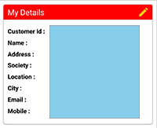
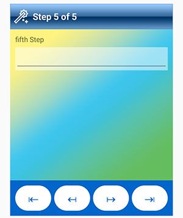
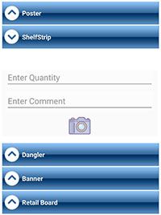
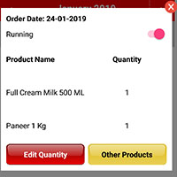
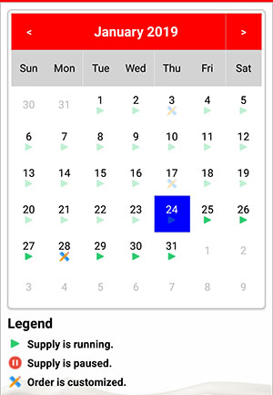

# Xamarin.Forms.CustomControls

Cross platform custom controls for xamarin forms for rapid and pleasing development

Controls Included: 1- RadioButton

 
  
   
2- Checkbox
   
  
  
   3- Stepper
   
  
   4- ImageButton
   
  
   5- Window
    
  
   6- Wizard
     
  
   7- CollapsibleExpander
   
  
   8- GradientView
   
  
   9- GradientContainer
    
  
   10- Popup
    
  
   11- RectangleView
   
  
   12- Validators 13- FieldView 14- Calendar
   
  
   

  15- TextBox
   
  
   

   16- Dropdown
   
  
   

  
